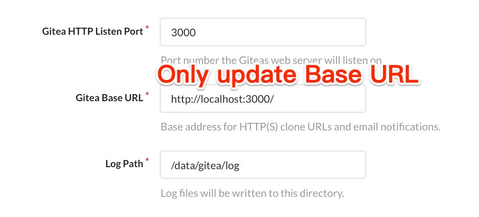

# gitea-docker

Installation Gitea with Docker

## Copy your `.env`

copy your .env file

```sh
cp -r .env.example .env
```

How to find your UID and GID:

```sh
# get UID
id -u
# get GID
id -g
```

## Start the Gitea

```yaml
version: "2"

networks:
  gitea:
    external: false

services:
  server:
    image: gitea/gitea:1.11.0
    environment:
      - USER_UID=${USER_UID}
      - USER_GID=${USER_GID}
      - SSH_PORT=2000
      - DISABLE_SSH=true
      - DB_TYPE=mysql
      - DB_HOST=db:3306
      - DB_NAME=gitea
      - DB_USER=gitea
      - DB_PASSWD=gitea
    restart: always
    networks:
      - gitea
    volumes:
      - gitea:/data
      - /etc/timezone:/etc/timezone:ro
      - /etc/localtime:/etc/localtime:ro
    ports:
      - "4000:3000"
      - "2000:22"

  db:
    image: mysql:5.7
    restart: always
    environment:
      - MYSQL_ROOT_PASSWORD=gitea
      - MYSQL_USER=gitea
      - MYSQL_PASSWORD=gitea
      - MYSQL_DATABASE=gitea
    networks:
      - gitea
    volumes:
      - mysql:/var/lib/mysql

volumes:
  gitea:
    driver: local
  mysql:
    driver: local
```

## open the install page

See the following screccnshots:


